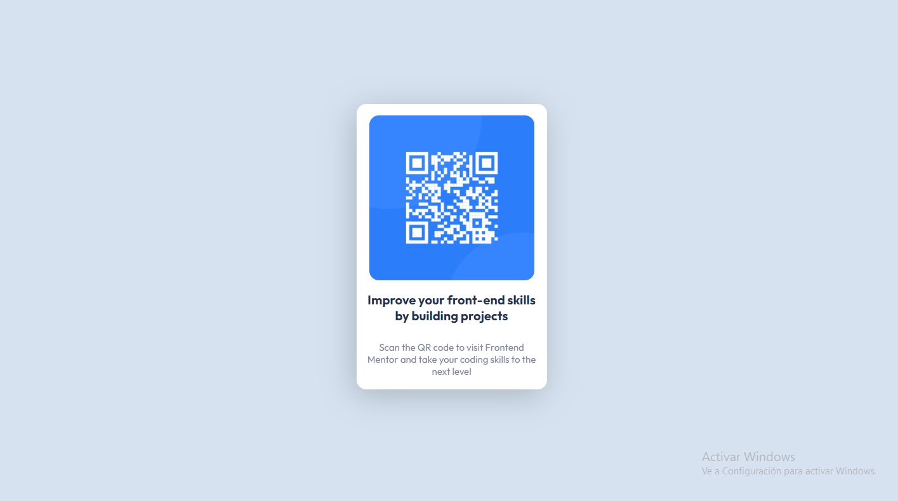

# Frontend Mentor - QR code component solution

This is a solution to the [QR code component challenge on Frontend Mentor](https://www.frontendmentor.io/challenges/qr-code-component-iux_sIO_H). Frontend Mentor challenges help you improve your coding skills by building realistic projects. 

## Overview

### Screenshot



## My process

### Built with

- HTML5
- CSS
- Flexbox
- Mobile-first workflow

### What I learned

I have learned to use the "flex-directio: column;" property to sort the data that made up the card and position it in the specified order.

```css
.card {
    background-color: hsl(0, 0%, 100%);
    width: 300px;
    height: 450px;
    border-radius: 15px;
    display: flex;
    flex-direction: column;
    justify-content: center;
    align-items: center;
    box-shadow: -5px 10px 50px rgba(0, 0, 0, 0.2);
}
```

### Continued development

I have tested my knowledge of Flexbox and have improved my way of using it, however it is something that along with Grid I need to continue to improve.

## Author

- Website - Agustin Minzoni
- Frontend Mentor - @TecnoZoni (https://www.frontendmentor.io/profile/TecnoZoni)
